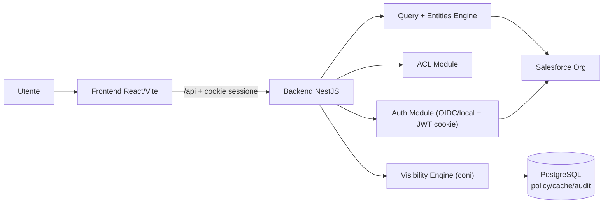

# Architecture Overview

## 1) Scopo
Questo documento descrive l architettura target del middleware che integra Salesforce come system of record, con:
- backend NestJS per orchestrazione API, sicurezza e governance accessi
- frontend React/Vite per UX applicativa
- policy di visibility row-level basata su coni con repository unico PostgreSQL

## 2) Obiettivi architetturali
- mantenere Salesforce come fonte dati business primaria
- centralizzare autenticazione, ACL e visibility nel backend
- abilitare configurazione funzionale senza hardcode diffuso (entity/query config-driven)
- garantire auditabilita delle decisioni di accesso
- ridurre il rischio di data leak con modello deny-by-default

## 3) Principi guida
- separazione delle responsabilita:
  - ACL decide cosa un utente puo usare
  - visibility decide quali record/campi puo vedere
- enforcement centralizzato: nessun endpoint dati puo bypassare i guardrail comuni
- fail-closed: in caso di errore policy/visibility, accesso negato
- configurazione versionata: policy e metadati gestiti in repository e tracciati

## 4) Vista ad alto livello

## 5) Componenti principali

### Backend (NestJS)
- `Auth`: login OIDC multi-provider e locale, sessione JWT HttpOnly, restore session
- `ACL`: catalogo persistito in PostgreSQL per risorse `rest:*`, `entity:*`, `query:*`, `route:*`, con discovery automatica e default fail-closed
- `Apps Catalog`: catalogo app con `items[]` tipizzati (`home`, `entity`, `custom-page`, `external-link`, `report`) e mapping permission -> app
- `Salesforce Connector`: query/CRUD/describe/search centralizzati via `jsforce`
- `Entities Engine`: configurazioni list/detail/form/related list guidate da JSON
- `Query Engine`: template query DSL/SOQL con validazioni runtime
- `Visibility Engine`: compilazione ed enforcement policy con deny-by-default

### Frontend (React/Vite)
- autenticazione tramite cookie di sessione backend
- launcher home che mostra le app disponibili per l utente autenticato
- routing protetto e navigazione dinamica guidata da ACL tramite `GET /navigation`
- catalogo route condiviso con il backend per path, label e ordinamento delle route shell
- backoffice `/#/admin/apps` per il catalogo app e integrazione ACL
- backoffice `/#/admin/metadata` per retrieve/preview/deploy di package zip YAML versionabili
- consumo endpoint backend senza accesso diretto a Salesforce

### PostgreSQL (Prisma)
Repository unico per visibility:
- `visibility.cones`
- `visibility.rules`
- `visibility.assignments`
- `visibility.user_scope_cache`
- `visibility.audit_log`

Repository tecnico aggiuntivo per catalogo app e ACL:
- `app_configs`
- `app_item_records`
- `app_permission_assignments`
- `acl_resources`
- `acl_resource_permissions`
- `acl_contact_permissions`

## 6) Flussi chiave

### 6.1 Login e sessione
1. Il setup iniziale crea la prima credenziale locale admin a partire da `adminEmail` e password bootstrap
2. Per OIDC il browser avvia `GET /auth/oidc/:providerId/start`; per login locale usa `POST /auth/login/password`
3. Backend valida identita esterna o credenziali locali e risolve Contact Salesforce attivo
4. Backend emette JWT e lo salva in cookie HttpOnly
5. `GET /auth/session` ricalcola i permission code effettivi come `defaultPermissions + acl_contact_permissions + admin fallback` e ruota il JWT; le altre request protette usano lo snapshot permessi gia presente nel cookie

### 6.2 Lettura dati protetta
1. richiesta API autenticata
2. verifica ACL su risorsa richiesta
3. risoluzione policy visibility (utente, permessi, recordType, oggetto)
4. compilazione filtro finale (`ALLOW`/`DENY`)
5. esecuzione query verso Salesforce scoped
6. audit decisione con motivazione

### 6.3 Configurazione dinamica
- entita e query template sono persistite in PostgreSQL e caricate on-demand dal backend
- i package metadata YAML restano il formato di export/import e deploy versionabile, non la sorgente runtime diretta
- create, update, delete e deploy metadata riallineano automaticamente le risorse ACL system correlate

### 6.4 Catalogo app e launcher
1. Il backoffice gestisce il catalogo app tramite `/#/admin/apps`
2. Ogni app definisce un set ordinato di `items[]` tipizzati con una `home` obbligatoria e unica
3. Gli item `entity` referenziano una entity configurata; gli altri item possono modellare pagine custom, link esterni e report embedded
4. Ogni permission puo pubblicare zero o piu app tramite `appIds`
5. Gli item diversi da `home` possono dichiarare un `resourceId` ACL opzionale per il filtro runtime
6. La home autenticata chiama `GET /apps/available`
7. Il backend filtra le app per permission effettive e poi filtra gli item runtime per `resourceId`; gli item `entity` richiedono anche ACL `entity:<entityId>`
8. Gli item embedded (`external-link`/`report` con `openMode='iframe'`) accettano solo URL `https` verso host allowlisted da `APP_EMBED_ALLOWED_HOSTS`
9. Un app resta visibile se ha la `home` accessibile o almeno un altro item accessibile
10. Il frontend salva in `localStorage` l `appId` selezionato per utente e usa route canoniche app-scoped `/#/app/:appId`, `/#/app/:appId/entity/:entityId`, `/#/app/:appId/items/:itemId`

## 7) Modello di sicurezza
- autenticazione OIDC multi-provider e locale + sessione cookie sicura
- ACL obbligatoria su endpoint e risorse
- visibility centralizzata row-level e field-level
- query raw Salesforce limitata ad amministrazione/incident e disabilitata in produzione
- validazioni input e whitelist operatori/campi per DSL visibility

## 8) Visibility a coni (sintesi)
- modello deny-by-default
- regole con effetti `ALLOW` e `DENY`
- precedenza: `DENY` vince sempre
- policy storage unico su PostgreSQL
- cache compilata per utente/oggetto/versione policy
- audit obbligatorio su decisione finale

## 9) Scelte tecnologiche
- runtime: Node.js 22 LTS
- backend: NestJS + TypeScript
- frontend: React + Vite + Tailwind
- integrazione Salesforce: `jsforce`
- DB tecnico: PostgreSQL + Prisma

## 10) Qualita e operativita
- lint/build/test in CI su backend e frontend
- migrazioni Prisma gestite in pipeline (`migrate deploy`)
- metriche: latenza query, hit/miss cache, errori policy/auth
- runbook produzione per deploy, incident e rollback

## 11) Contratti applicativi rilevanti
Catalogo app admin:
- `GET /apps/admin` -> `{ items: [{ id, label, description?, sortOrder, itemCount, entityCount, permissionCount, updatedAt }] }`
- `GET /apps/admin/:appId` -> `{ app: { id, label, description?, sortOrder, permissionCodes: string[], items: AppItemConfig[] } }`
- `POST|PUT /apps/admin` -> `{ app: { id, label, description?, sortOrder?, permissionCodes: string[], items: AppItemConfig[] } }`

`AppItemConfig` supporta:
- `home` -> `{ id, kind: 'home', label, description?, page: { blocks[] } }`
- `entity` -> `{ id, kind: 'entity', label, description?, entityId, resourceId? }`
- `custom-page` -> `{ id, kind: 'custom-page', label, description?, resourceId?, page: { blocks[] } }`
- `external-link` -> `{ id, kind: 'external-link', label, description?, resourceId?, url, openMode: 'new-tab' | 'iframe', iframeTitle?, height? }`
- `report` -> `{ id, kind: 'report', label, description?, resourceId?, url, openMode: 'new-tab' | 'iframe', iframeTitle?, height?, providerLabel? }`

Launcher utente:
- `GET /apps/available` -> `{ items: [{ id, label, description?, items: AvailableAppItem[] }] }`
- `AvailableAppItem` riusa i kind admin, con arricchimento runtime per `entity` -> `{ entityId, objectApiName, keyPrefix? }`
- il launcher non introduce un nuovo enforcement applicativo oltre ad ACL e visibility gia esistenti
- la selezione dell app resta un contesto UI persistito per utente nel browser

ACL admin permission:
- mutation permission -> `{ permission: { code, label?, description?, aliases? }, appIds: string[] }`
- detail permission -> `appIds[]` e `appCount`

Metadata admin:
- `POST /metadata/admin/export` -> `application/zip`
- `POST /metadata/admin/preview` -> summary diff del package zip
- `POST /metadata/admin/deploy` -> apply batch `upsert` con `packageHash` e `targetFingerprint`

## 12) Confini e non-obiettivi
- Salesforce resta system of record business
- PostgreSQL non sostituisce Salesforce sui dati dominio, ma governa policy/cache/audit visibility
- il frontend non applica regole di sicurezza definitive: enforcement finale solo backend

## 13) Roadmap adozione
- Fase A: foundation (monorepo, auth, connector)
- Fase B: ACL e navigazione
- Fase C: entities/query config-driven
- Fase D: visibility engine + audit + policy repository PostgreSQL
- Fase E: hardening, performance, runbook

## 14) Documenti correlati
- `docs/security-model.md`
- `docs/acl-resources-map.md`
- `docs/entity-config-guide.md`
- `docs/query-template-guide.md`
- `docs/visibility-cones-guide.md`
- `docs/prisma-postgres-guide.md`
- `docs/runbook-production.md`
