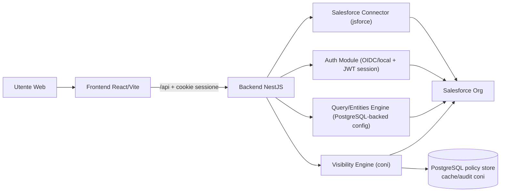

# Guida completa - architettura connettore Salesforce (da progetto vuoto)

## Indice dei punti chiave

- Obiettivo: replicare da zero una piattaforma middleware completa per integrare Salesforce con backend NestJS e frontend React/Vite.
- Principio base: Salesforce resta system of record; il middleware governa auth, ACL, visibilita e API UX.
- Stack: Node.js 22, NestJS, React/Vite, `jsforce`, OIDC server-side + auth locale, PostgreSQL + Prisma.
- Backend core: moduli `Auth`, `Salesforce`, `ACL`, `Entities`, `Query`, `Navigation`, `GlobalSearch`.
- Connettore Salesforce: servizio centralizzato con retry, caching, describe, query/CRUD uniformi.
- Auth/sessione: login OIDC multi-provider o locale, validazione Contact Salesforce, cookie JWT `HttpOnly`, restore via `/auth/session`.
- ACL: controllo capability su risorse `rest:*`, `entity:*`, `query:*`, `route:*`.
- Layer config-driven: entita, ACL e query definite in configurazione versionata su PostgreSQL, non hardcoded.
- Visibilita row-level: engine a coni con regole `ALLOW/DENY` e modello `deny-by-default`.
- Postgres + Prisma: storage unico policy visibility, cache coni compilati e audit log.
- Sicurezza: whitelist, validazione input, blocco query non read-only, enforcement centralizzato ACL + visibility.
- Operativita: migrazioni Prisma, CI/CD con `prisma generate` + `prisma migrate deploy`, test backend/frontend/integration.
- Roadmap: Foundation -> Access Control -> Data Layer -> Visibility -> Hardening.

## 1) Obiettivo della guida

Questa guida descrive come replicare da zero una piattaforma middleware stile `codestorm-middleware`:

- backend NestJS con connettore Salesforce centralizzato
- frontend React/Vite con autenticazione backend-driven e sessione cookie
- modello config-driven per entity, query e navigation con source of truth PostgreSQL
- ACL applicativa e visibilita row-level
- practice operative su sicurezza, performance, audit e rilascio

## 2) Principi architetturali

1. Salesforce e il system of record dei dati business.
2. Il middleware governa autenticazione, autorizzazione, visibilita e UX API.
3. Le regole non vanno hardcodate dove possibile, ma spostate in configurazione versionata.
4. Ogni endpoint dati deve passare da guardrail comuni: sessione, ACL, visibilita, validazioni input.
5. Le query verso Salesforce devono essere centralizzate in un unico connettore con retry e osservabilita.

## 3) Target architecture



## 4) Stack consigliato

- Runtime: Node.js 22 LTS
- Backend: NestJS + TypeScript + class-validator
- Frontend: React + Vite + TypeScript + Tailwind
- Salesforce SDK: `jsforce`
- Auth federata: provider OIDC avviati dal backend + login locale username/password
- ORM/DB toolkit: Prisma (`prisma` + `@prisma/client`)
- Database policy visibility: PostgreSQL + Prisma (obbligatorio per coni/audit)

## 5) Bootstrap monorepo da zero

### 5.1 Struttura iniziale

```text
project-root/
  backend/
  frontend/
  docs/
  package.json
```

### 5.2 package.json root

Script minimi allineati al modello:

- `npm run start:dev --workspace backend`
- `npm run dev --workspace frontend`
- `npm run build --workspace backend`
- `npm run build --workspace frontend`
- `npm run lint --workspaces`

### 5.3 Workspace

Configurare npm workspaces con:

- `backend`
- `frontend`

### 5.4 Template env (progetto realmente vuoto)

Se parti da repository blank, crea prima i template:

- `backend/.env.example`
- `frontend/.env.example`

Poi crea i file runtime:

- `backend/.env`
- `frontend/.env`

Nota operativa:

- se i file `.env.example` esistono gia, copiali e completa i valori
- se i template non esistono, crea direttamente `.env` usando la checklist in sezione 19

## 6) Backend blueprint (NestJS)

### 6.1 Moduli core da prevedere

- `AuthModule`
- `SalesforceModule`
- `AclModule`
- `EntitiesModule`
- `QueryModule`
- `NavigationModule`
- `GlobalSearchModule`
- moduli dominio (HR, Sales, Operations, ecc.)

### 6.2 main.ts

Pattern da replicare:

- global prefix API: `/api`
- CORS con `credentials: true` e origini da env
- `ValidationPipe` globale (`whitelist`, `forbidNonWhitelisted`, `transform`)
- Swagger con auth via cookie di sessione

### 6.3 AppModule

Pattern da replicare:

- `ConfigModule.forRoot({ isGlobal: true })`
- import dei moduli in ordine: ACL -> Auth -> Salesforce -> moduli applicativi
- static serving frontend opzionale in produzione

### 6.4 Integrazione Prisma (PostgreSQL)

Standard consigliato per il nuovo progetto:

- install backend workspace: `npm install @prisma/client --workspace backend`
- install dev dependency backend: `npm install -D prisma --workspace backend`
- inizializzazione (da root, workspace-safe): `npm exec --workspace backend prisma -- init --schema prisma/schema.prisma`

Struttura minima:

```text
backend/
  prisma/
    schema.prisma
    migrations/
  src/
    prisma/
      prisma.module.ts
      prisma.service.ts
```

Esempio `schema.prisma` (base):

```prisma
generator client {
  provider = "prisma-client-js"
}

datasource db {
  provider = "postgresql"
  url      = env("DATABASE_URL")
}
```

Comandi operativi:

- generazione client: `npm exec --workspace backend prisma -- generate --schema prisma/schema.prisma`
- migrazione locale: `npm exec --workspace backend prisma -- migrate dev --schema prisma/schema.prisma`
- deploy migrazioni: `npm exec --workspace backend prisma -- migrate deploy --schema prisma/schema.prisma`

Practice:

- usare Prisma per tutte le tabelle visibility middleware (policy/audit/cache)
- mantenere Salesforce fuori da Prisma (resta integrato via `jsforce`)
- evitare SQL inline nei service, salvo query ottimizzate e tracciate

## 7) Connettore Salesforce (practice centrale)

### 7.1 Responsabilita del SalesforceService

- login tecnico con credenziali integrazione
- caching connessione
- retry automatico su invalid session
- metodi uniformi per query/CRUD/describe/search
- sanitizzazione minima e logging errori

### 7.2 API del connettore da standardizzare

- `query(soql, options)`
- `queryMore(locator, options)`
- `search(sosl)`
- `describeGlobal()`
- `describeObject(objectApiName)`
- `describeObjectFields(objectApiName)`
- `insertRecords(objectApiName, records)`
- `updateRecords(objectApiName, records)`
- `upsertRecords(objectApiName, records, externalIdField)`
- `deleteRecords(objectApiName, recordIds)`
- eventuali `postApexRest`/`patchApexRest`

### 7.3 Regole operative del connettore

- mai usare `Connection` jsforce direttamente nei service dominio
- validare sempre recordId 15/18 char dove applicabile
- normalizzare batch size query (1..2000)
- loggare errori con messaggio tecnico ma senza leak dati sensibili

### 7.4 Endpoint Salesforce “tooling”

Conservare endpoint amministrativi, protetti da guard e ACL stretta:

- `POST /salesforce/query` (read-only SELECT) solo per `PORTAL_ADMIN` e solo con feature flag `ENABLE_RAW_SALESFORCE_QUERY=true`
- `GET /salesforce/objects`
- `GET /salesforce/objects/:objectApiName`
- `GET /salesforce/objects/:objectApiName/fields`

Regola obbligatoria in produzione:

- `ENABLE_RAW_SALESFORCE_QUERY=false` di default
- endpoint raw query disabilitato in produzione salvo finestra di debug/incident esplicitamente approvata

### 7.5 Contratto tecnico `queryMore` (obbligatorio)

- non esporre mai il locator Salesforce raw al client
- la prima query scoped restituisce un `nextCursor` opaco firmato dal backend
- payload minimo del cursor: `locator`, `contact_id`, `permissions_hash`, `record_type`, `object_api_name`, `query_hash`, `policy_version`, `expires_at`, `nonce`
- validazioni su `queryMore`: firma, TTL, binding alla sessione corrente, coerenza `policy_version` e `query_hash`
- in caso di mismatch/scadenza: `DENY` + evento audit security (`CURSOR_SCOPE_MISMATCH` o `CURSOR_EXPIRED`)
- alternativa equivalente ammessa: store server-side (Redis/Postgres) con cursor id random e metadati scoped

## 8) Autenticazione e sessione

### 8.1 Flussi login supportati

1. Frontend legge i provider attivi da `GET /auth/providers`.
2. Per i provider OIDC il browser viene rediretto verso `GET /auth/oidc/:providerId/start`.
3. Backend esegue discovery OIDC, `state`/`nonce`/PKCE, token exchange e validazione `id_token`.
4. Per login locale il frontend usa `POST /auth/login/password`.
5. In entrambi i casi il backend trova il Contact attivo su Salesforce e genera il JWT interno nel cookie `HttpOnly`.

### 8.2 Endpoint auth minimi

- `GET /auth/providers`
- `GET /auth/oidc/:providerId/start`
- `GET /auth/oidc/:providerId/callback`
- `POST /auth/login/password`
- `GET /auth/session` (refresh user + permessi da PostgreSQL e rotazione cookie sessione)
- `POST /auth/logout`
- `GET /auth/csrf` (consigliato per bootstrap token CSRF)
- opzionale: `login-as` per admin

### 8.3 Dati utente sessione consigliati

- `sub` (Salesforce Contact Id)
- `email`
- `name`, `givenName`, `familyName`
- `recordType`
- `permissions`
- `ip` o altro claim di binding sessione

Nota operativa:
- `permissions` nel JWT interno derivano dal merge tra default permissions ACL globali e assegnazioni dirette al `Contact` salvate su PostgreSQL
- una modifica alle assegnazioni dirette diventa effettiva al prossimo `/auth/session` o nuovo login

### 8.4 Practice sicurezza sessione e CSRF

- cookie `HttpOnly`, `Secure` in produzione, `SameSite` adeguato (`Lax` default; `None` solo se strettamente necessario cross-site)
- expiry breve e rotazione su restore session
- invalidazione robusta su logout
- endpoint mutativi (`POST`, `PUT`, `PATCH`, `DELETE`) protetti con strategia CSRF formale
- `double-submit cookie` obbligatorio (cookie CSRF non HttpOnly + header `X-CSRF-Token`)
- validazione `Origin`/`Referer` su whitelist `FRONTEND_ORIGINS`
- `Content-Type: application/json` obbligatorio per chiamate mutative API browser, salvo endpoint esplicitamente dichiarati `multipart/form-data`
- anche per endpoint `multipart/form-data` restano obbligatori token CSRF e validazione `Origin`/`Referer`
- fallimento CSRF => `403` + audit reason `CSRF_VALIDATION_FAILED`

## 9) ACL applicativa

### 9.1 Design

Gestire ACL via store PostgreSQL:

- `permissions`
- `defaults`
- `contact_permissions`
- `resources`

### 9.2 Tipi risorsa

- `rest:*`
- `entity:*`
- `query:*`
- `route:*`

### 9.3 Regola pratica

Prima si verifica l accesso alla capability (ACL), poi si applica visibilita row-level (coni).

## 10) Layer config-driven per entity

### 10.1 Struttura consigliata

record PostgreSQL per `entity_configs` e tabelle correlate con:

- blocco `base`
- blocco `list` + views ordinate
- blocco `detail` + sections/related lists ordinate
- blocco `form` + sections ordinate

### 10.2 Vantaggi

- nuove viste senza cambiare codice backend
- coerenza tra list/detail/form
- manutenzione rapida per team funzionale

### 10.3 Endpoint standard

- `GET /entities`
- `GET /entities/:entityId/config`
- `GET /entities/:entityId/list`
- `GET /entities/:entityId/records/:recordId`
- `GET /entities/:entityId/form/:recordId`
- `GET /entities/:entityId/related/:relatedListId`
- `POST /entities/:entityId/records`
- `PUT /entities/:entityId/records/:recordId`

## 11) Query Engine template-based

### 11.1 Obiettivo

Gestire query complesse e riusabili via template persistiti in PostgreSQL, evitando SOQL sparsa nei service.

### 11.2 Tipi supportati

- template `soql` legacy
- template DSL (`select`, `where`, `orderBy`, `limit`, `parameters`)

### 11.3 File struttura

tabella PostgreSQL `query_templates`

### 11.4 Capacita da prevedere

- validazione parametri runtime
- ACL su singolo template (`query:<templateId>`)
- cache opzionale per template con TTL
- `requireAnyOf` per vincoli funzionali

## 12) Frontend blueprint

### 12.1 Provider e routing

- `HashRouter` o `BrowserRouter` in base al deploy
- `AuthProvider` con bootstrap sessione da `/auth/session`
- `RequireAuth` per route protette

### 12.2 Pattern servizi API

- un wrapper fetch condiviso (`credentials: include`)
- invio header CSRF (`X-CSRF-Token`) sulle chiamate mutative
- emissione evento session expired su 401
- error handling centralizzato

### 12.3 Config frontend minima

- `VITE_API_BASE_URL` (`/api` in dev)
- nessun SDK auth esterno richiesto nel frontend

### 12.4 Vite proxy in sviluppo

Proxy `/api` -> backend locale (`http://localhost:3000`) per semplificare CORS e cookie.
Il proxy deve preservare/forwardare host e proto originali per consentire al backend di derivare il callback OIDC pubblico corrente.

## 13) Navigation e UX dinamica

- navigation caricata dal backend con endpoint dedicato
- rendering menu lato frontend in base ad ACL effettive
- ricerca globale opzionale con endpoint `/global-search`

## 14) Visibilita row-level (coni)

### 14.1 Problema

Con utenza Salesforce di integrazione singola, lo sharing nativo per utente non si applica automaticamente alle API del middleware.

### 14.2 Soluzione

Introdurre un `Visibility Engine` che compone predicati SOQL in base a:

- utente
- permessi
- record type
- assegnazione coni/rule

### 14.3 Repository policy su PostgreSQL (fonte unica)

- `visibility.cones`
- `visibility.rules`
- `visibility.assignments`

### 14.4 Ruolo di PostgreSQL (obbligatorio)

Usare PostgreSQL per:

- repository unico di configurazione coni/rule/assegnazioni
- cache coni compilati per utente/oggetto
- snapshot regole e assegnazioni risolte
- audit log decisioni di visibilita

Nota:

- non usare custom object Salesforce per memorizzare la configurazione dei coni.

### 14.5 Regola sicurezza

`deny-by-default`: senza almeno una regola ALLOW valida, nessun dato restituito.

### 14.6 Algoritmo di valutazione (deterministico e obbligatorio)

1. Costruire il contesto utente (`contactId`, `permissions`, `recordType`, timestamp corrente).
2. Caricare le assegnazioni valide nel timestamp corrente (assi per `contact`, `permission_code`, `record_type`) con regola deterministica:
   - ogni assignment deve avere almeno un selettore valorizzato
   - semantica di match `AND` su tutti i selettori valorizzati della stessa assignment
   - per ottenere semantica `OR`, usare assignment separate
3. Ordinare i coni applicabili per `priority DESC`, poi `code ASC` (tie-break stabile).
4. Filtrare solo regole `active` riferite all oggetto richiesto.
5. Costruire `ALLOW_EXPR` come OR di tutte le regole `ALLOW` valide.
6. Costruire `DENY_EXPR` come OR di tutte le regole `DENY` valide.
7. Comporre il filtro finale: se `ALLOW_EXPR` e vuota, deny immediato; altrimenti `FINAL = (BASE_WHERE) AND (ALLOW_EXPR) AND NOT (DENY_EXPR)`.
8. Precedenza conflitti: `DENY` vince sempre su `ALLOW`.
9. Regole field-level: il set finale e l intersezione delle whitelist ALLOW (`fields_allowed`) applicabili, meno eventuali campi esplicitamente negati (`fields_denied`); in caso di conflitto, `fields_denied` prevale; se il set finale e vuoto, deny.
10. Regole invalide (campo o operatore non supportato): scarto regola + audit; se dopo lo scarto non resta alcuna ALLOW valida, deny.

### 14.7 Specifica formale DSL v1

Obiettivo:

- definire una grammatica limitata, validabile e compilabile in SOQL in modo deterministico
- garantire modalita fail-closed in caso di input non valido

Strutture supportate:

- predicato atomico: `{"field":"<FieldPath>","op":"<Operator>","value":<Value>}`
- gruppo AND: `{"all":[<Rule>, ...]}`
- gruppo OR: `{"any":[<Rule>, ...]}`
- negazione: `{"not":<Rule>}`

Definizione:

- `Rule = Predicate | GroupAll | GroupAny | GroupNot`

Operatori ammessi v1:

- `=`, `!=`, `>`, `>=`, `<`, `<=`
- `IN`, `NOT IN`
- `LIKE`
- `STARTS_WITH` (compilato in `LIKE 'value%'`)
- `CONTAINS` (compilato in `LIKE '%value%'`)
- `IS_NULL`, `IS_NOT_NULL`

Limiti hard (obbligatori):

- profondita massima albero: `6`
- nodi massimi per regola: `100`
- figli massimi per gruppo `all/any`: `20`
- cardinalita massima array `IN/NOT IN`: `200`
- lunghezza massima valore stringa: `255`

Limiti hard query compilata (obbligatori):

- lunghezza massima SOQL compilata: `20000` caratteri
- campi massimi in `SELECT`: `100`
- clausole massime in `ORDER BY`: `3`
- disgiunzioni OR massime dopo compilazione: `25`
- per oggetti high-volume (>= `100000` record), richiedere almeno un predicato selettivo su campo indicizzato o external id

Validazioni obbligatorie:

- `field` deve rispettare regex `^[A-Za-z_][A-Za-z0-9_.]*$`
- `op` deve appartenere alla whitelist operatori
- `IN/NOT IN` richiedono array non vuoto
- `IS_NULL/IS_NOT_NULL` non accettano `value`
- ogni literal deve essere escaped prima della compilazione SOQL
- query compilata oltre limiti hard: deny + audit reason `QUERY_LIMIT_EXCEEDED`
- query non selettiva su oggetto high-volume: deny + audit reason `NON_SELECTIVE_QUERY`
- regola invalida: scarto + audit; se nessuna ALLOW valida resta applicabile, deny

### 14.8 Matrice ufficiale copertura query (Fase 1 visibility)

Nota:

- questa Fase 1 e una sottofase interna della Fase D della roadmap generale (sezione 23).

| Tipo query/endpoint                       | Copertura Fase 1 visibility | Note operative                               |
| ----------------------------------------- | --------------------------- | -------------------------------------------- |
| Entity list                               | Coperto                     | Enforce row-level su oggetto lista           |
| Entity detail                             | Coperto                     | Enforce row-level su record singolo          |
| Entity related list                       | Coperto                     | Enforce row-level su oggetto related         |
| Entity form (read prefill)                | Coperto                     | Enforce su query di caricamento form         |
| Entity bundle (read)                      | Coperto                     | Enforce su tutte le sotto-query incluse      |
| Query template DSL/SOQL                   | Coperto                     | Enforce per oggetto target template          |
| Pagination `queryMore`                    | Coperto                     | Solo cursor opachi firmati emessi da query scoped |
| Write create                              | Coperto parziale            | Enforce entity ACL + object visibility, senza row-level pre-persistenza |
| Write update/delete                       | Coperto                     | Enforce object visibility + preflight row-level sul record |
| Global search                             | Escluso                     | Pianificato in fase successiva               |
| Endpoint raw query (`/salesforce/query`)  | Escluso                     | Solo debug admin, disabilitato in produzione |

### 14.9 Cache policy: invalidazione e SLA

Chiavi cache minime:

- `policy_definition`: `object_api_name|policy_version`
- `user_scope`: `contact_id|permissions_hash|record_type|object_api_name|policy_version`

Regole di invalidazione:

- ogni modifica a `visibility.cones`, `visibility.rules`, `visibility.assignments` deve produrre incremento `policy_version`
- invalidare tutte le cache associate all `object_api_name` interessato
- invalidazione e update versione devono essere atomici rispetto alla modifica policy
- prevedere endpoint operativo di purge completa in emergenza

SLA propagazione policy:

- target operativo: `P95 <= 30s`
- limite massimo accettabile: `<= 120s`
- oltre il limite massimo: comportamento fail-closed + audit con reason code `POLICY_STALE`

## 15) Data model Postgres per visibility (fonte unica)

Tabelle minime consigliate:

- `visibility.cones`
- `visibility.rules`
- `visibility.assignments`
- `visibility.user_scope_cache`
- `visibility.audit_log`

Indici consigliati:

- `rules(object_api_name, active)`
- `assignments(contact_id, permission_code, record_type, valid_from, valid_to)`
- indice parziale wildcard: `assignments(contact_id, permission_code, valid_from, valid_to) WHERE record_type IS NULL`
- partizionamento mensile `audit_log` su `created_at`

Nota implementativa:

- mappare queste tabelle in modelli Prisma (`backend/prisma/schema.prisma`)
- centralizzare accesso DB in repository/service dedicati (`VisibilityRepository`, `VisibilityAuditRepository`)
- `visibility.rules` deve modellare esplicitamente sia `fields_allowed` sia `fields_denied`
- `visibility.assignments` deve impedire righe con tutti i selettori null (`contact_id`, `permission_code`, `record_type`)

## 16) Sicurezza end-to-end

Checklist minima:

- blocco query non-SELECT su endpoint query raw
- feature flag hardening su endpoint raw query (`ENABLE_RAW_SALESFORCE_QUERY`, default `false`)
- whitelist oggetti e campi per endpoint generici
- sanitizzazione placeholder SOQL
- ACL obbligatoria su ogni endpoint
- visibilita row-level centralizzata
- protezione CSRF formale su endpoint mutativi (double-submit + controlli Origin/Referer)
- `queryMore` ammesso solo con cursor opaco firmato o store server-side scoped
- audit decisioni di accesso
- secret management fuori dal codice

## 17) Osservabilita

- logging strutturato per request id
- tempi query Salesforce e retry count
- metriche di cache hit/miss (describe, template, visibility)
- alert su errori auth, Salesforce timeout, policy engine fail

### 17.1 Contratto audit minimo (visibility)

Scope:

- questo schema copre solo decisioni del motore visibility (row-level) dopo superamento dei gate auth/sessione/CSRF
- eventi di sicurezza pre-visibility usano il contratto dedicato in 17.2

Campi obbligatori per ogni decisione:

- `request_id`
- `created_at`
- `contact_id`
- `permissions_hash`
- `record_type`
- `object_api_name`
- `query_kind`
- `base_where_hash`
- `final_where_hash`
- `applied_cones` (codes/ids)
- `applied_rules` (ids + effect)
- `decision` (`ALLOW` o `DENY`)
- `decision_reason_code`
- `row_count`
- `duration_ms`
- `policy_version`

Codici motivo minimi (`decision_reason_code`):

- `ALLOW_MATCH`
- `DENY_MATCH`
- `NO_ALLOW_RULE`
- `INVALID_RULE_DROPPED`
- `FIELDSET_EMPTY`
- `POLICY_STALE`
- `QUERY_LIMIT_EXCEEDED`
- `NON_SELECTIVE_QUERY`

Retention minima:

- dettaglio completo eventi: `180 giorni`
- aggregati giornalieri: `24 mesi`
- legal hold: sospende purge su dataset coinvolti

Tracciabilita:

- deve essere sempre ricostruibile la decisione "perche vedo/non vedo" a partire da `policy_version`, `applied_rules`, `decision_reason_code`

### 17.2 Contratto audit minimo (security gateway)

Scope:

- eventi bloccati prima del motore visibility (es. CSRF, validazione cursor `queryMore`, sessione non valida)

Campi obbligatori:

- `request_id`
- `created_at`
- `contact_id` (nullable se utente non autenticato)
- `endpoint`
- `http_method`
- `event_type` (`AUTH`, `SESSION`, `CSRF`, `CURSOR`, `INPUT`)
- `decision` (`ALLOW` o `DENY`)
- `reason_code`
- `ip_hash`
- `user_agent_hash`

Codici motivo minimi (`reason_code`):

- `CSRF_VALIDATION_FAILED`
- `CURSOR_SCOPE_MISMATCH`
- `CURSOR_EXPIRED`
- `SESSION_INVALID`
- `ORIGIN_NOT_ALLOWED`
- `INPUT_VALIDATION_FAILED`

## 18) Performance

- cache describe Salesforce con TTL configurabile
- query pagination con `queryMore`
- batch size controllata
- caching template query ad alto costo
- precompilazione predicati visibility su chiavi utente

## 19) Variabili ambiente minime

### 19.1 Backend

- `PORT`
- `FRONTEND_ORIGINS`
- `JWT_SECRET`
- `JWT_EXPIRES_IN`
- `SESSION_COOKIE_NAME`
- `SESSION_COOKIE_MAX_AGE_MS`
- `SESSION_COOKIE_SECURE`
- `SESSION_COOKIE_SAMESITE`
- `SALESFORCE_USERNAME`
- `SALESFORCE_PASSWORD`
- `SALESFORCE_SECURITY_TOKEN`
- `SALESFORCE_LOGIN_URL`
- `SALESFORCE_DESCRIBE_CACHE_TTL_MS` (default `21600000`)
- `SALESFORCE_DESCRIBE_STALE_WHILE_REVALIDATE_MS` (default `21600000`)
  - in sviluppo `0` disabilita di fatto la cache describe e forza il refresh a ogni lettura
- `LOCAL_AUTH_ENABLED`
- `LOCAL_AUTH_LABEL`
- `SETUP_SECRETS_KEY`
- `ENABLE_RAW_SALESFORCE_QUERY` (default `false`)
- `DATABASE_URL`
- `SHADOW_DATABASE_URL` (opzionale, utile per `prisma migrate dev`)

### 19.2 Frontend

- `VITE_API_BASE_URL`
- nessuna variabile obbligatoria per SDK auth esterni

### 19.3 Postgres (obbligatorio)

- `DATABASE_URL` e definita in 19.1 (riusata da Prisma)
- `VISIBILITY_DB_SCHEMA`
- `VISIBILITY_CACHE_TTL_SECONDS`
- `VISIBILITY_AUDIT_ENABLED`
- `VISIBILITY_POLICY_PROPAGATION_TARGET_SECONDS` (default `30`)
- `VISIBILITY_POLICY_PROPAGATION_HARD_LIMIT_SECONDS` (default `120`)
- `VISIBILITY_AUDIT_RETENTION_DAYS` (default `180`)
- `VISIBILITY_AUDIT_AGGREGATE_RETENTION_MONTHS` (default `24`)

## 20) Setup operativo locale

1. `npm install`
2. se i template esistono: `cp backend/.env.example backend/.env` e `cp frontend/.env.example frontend/.env`
3. se i template non esistono: crea direttamente `backend/.env` e `frontend/.env` dalla checklist della sezione 19
4. configura almeno `DATABASE_URL`, `SETUP_SECRETS_KEY` e le credenziali Salesforce; il primo login admin locale viene creato durante il setup iniziale
5. i provider OIDC si configurano successivamente dal backoffice `Auth > Providers`; il callback viene mostrato come campo read-only derivato dal dominio pubblico corrente e `SETUP_SECRETS_KEY` cifra i `clientSecret` persistiti a DB
6. migrazioni DB: `npm exec --workspace backend prisma -- migrate dev --schema prisma/schema.prisma`
7. avvio backend: `npm run start:dev --workspace backend`
8. avvio frontend: `npm run dev --workspace frontend`
9. verifica health base su `http://localhost:3000/api/docs` e web app su `http://localhost:5173`

## 21) CI/CD consigliata

Pipeline minima:

1. install dipendenze
2. lint monorepo
3. `npm exec --workspace backend prisma -- generate --schema prisma/schema.prisma`
4. build backend/frontend
5. test unit/integration
6. publish artifact
7. deploy backend
8. `npm exec --workspace backend prisma -- migrate deploy --schema prisma/schema.prisma`
9. deploy frontend
10. smoke test endpoint auth/query principali

## 22) Strategia test

### 22.1 Backend

- unit test su service core (`AuthService`, `QueryService`, `VisibilityCompiler`)
- integration test endpoint protetti con cookie sessione
- contract test su template query e entity config
- integration test repository Prisma su schema visibility

### 22.2 Frontend

- test servizi API (error mapping e 401 handling)
- test route protection
- test rendering page entity list/detail/form

### 22.3 Salesforce connector

- test con org sandbox
- test retry su invalid session
- test query pagination (`queryMore`)

### 22.4 Test matrix obbligatoria (visibility)

| ID       | Scenario                                     | Esito atteso                             |
| -------- | -------------------------------------------- | ---------------------------------------- |
| `VIZ-01` | Nessuna assignment valida per utente/oggetto | `DENY`                                   |
| `VIZ-02` | Almeno una regola ALLOW valida e matchata    | `ALLOW`                                  |
| `VIZ-03` | ALLOW e DENY entrambe matchate               | `DENY` (deny precedence)                 |
| `VIZ-04` | Piu regole ALLOW matchate                    | Composizione OR corretta                 |
| `VIZ-05` | Regola invalida ma altre ALLOW valide        | ALLOW/DENY coerente + audit invalid rule |
| `VIZ-06` | Tutte le ALLOW scartate come invalide        | `DENY`                                   |
| `VIZ-07` | Intersezione field-level ALLOW vuota         | `DENY`                                   |
| `VIZ-08` | Assignment scaduta (`valid_to` passato)      | non applicata                            |
| `VIZ-09` | Assignment per `permission_code` matchata    | applicata                                |
| `VIZ-10` | Assignment per `record_type` non compatibile | non applicata                            |
| `VIZ-11` | `queryMore` con cursor non valido/non scoped | `DENY` + evento in security audit        |
| `VIZ-12` | Modifica policy con cache calda              | nuova policy visibile entro SLA          |
| `VIZ-13` | Audit evento                                 | presenza campi obbligatori + reason code |
| `VIZ-14` | Performance compilazione                     | entro budget definito                    |
| `VIZ-15` | Query compilata oltre limiti hard            | `DENY` + `QUERY_LIMIT_EXCEEDED`          |
| `VIZ-16` | Query non selettiva su oggetto high-volume   | `DENY` + `NON_SELECTIVE_QUERY`           |
| `VIZ-17` | Assignment con `contact_id` + `permission_code`, match solo uno | non applicata (semantica AND) |
| `VIZ-18` | Assignment con tutti i selettori `NULL`      | invalida/scartata (mai applicabile)      |
| `VIZ-19` | Campo in `fields_allowed` e `fields_denied`  | campo rimosso (deny precedence)          |
| `VIZ-20` | Set campi finale vuoto dopo deny field-level | `DENY` + `FIELDSET_EMPTY`                |

Gate di rilascio:

- nessun test `VIZ-01..VIZ-20` fallito
- copertura test unit visibility compiler/enforcer >= `90%`

## 23) Roadmap implementazione su progetto vuoto

### Fase A - Foundation

- scaffolding monorepo + backend/frontend
- auth OIDC/local + session cookie
- SalesforceService centralizzato

### Fase B - Access control

- ACL config e enforcement rest/entity/query
- navigation dinamica

### Fase C - Data layer

- Entities config-driven su PostgreSQL
- Query templates DSL
- global search

### Fase D - Visibility

- coni di visibilita con deny-by-default
- audit decisioni
- repository policy PostgreSQL via Prisma

### Fase E - Hardening

- performance tuning
- observability completa
- runbook incident e checklist release

## 24) Definition of Done (adozione completa)

La piattaforma e pronta quando:

- il login utente e stabile e ripristinabile via `/auth/session`
- ogni endpoint dati applica ACL + visibility
- nuove entity/query si configurano via PostgreSQL senza modifica codice core
- i log consentono di spiegare chi ha visto cosa e perche
- i tempi risposta restano entro SLA definiti

## 25) Errori tipici da evitare

- query Salesforce dirette fuori dal connettore centralizzato
- ACL applicata solo a livello UI ma non backend
- visibilita row-level dispersa nei singoli service
- cookie di sessione non configurati correttamente in produzione
- configurazioni entity/query non versionate

## 26) Modello decisionale (build vs buy)

Usa questa architettura quando:

- vuoi evitare costo lineare licenze community per utente
- ti serve UX/API altamente custom
- puoi sostenere governance tecnica di sicurezza applicativa

Valuta Partner Community quando:

- vuoi massimizzare nativamente sharing/security Salesforce
- hai bisogno minimo di logica middleware custom

## 27) Deliverable consigliati nel nuovo progetto

- `docs/architecture-overview.md`
- `docs/security-model.md`
- `docs/acl-resources-map.md`
- `docs/entity-config-guide.md`
- `docs/query-template-guide.md`
- `docs/visibility-cones-guide.md`
- `docs/prisma-postgres-guide.md`
- `docs/runbook-production.md`

## 28) Nota finale

Questa architettura separa chiaramente:

- governance accessi applicativi (ACL)
- governance visibilita dati (coni)
- integrazione tecnica Salesforce (connector)

La separazione e il fattore principale che permette scalabilita funzionale e controllo costi rispetto a un modello centrato solo su utenze community Salesforce.
